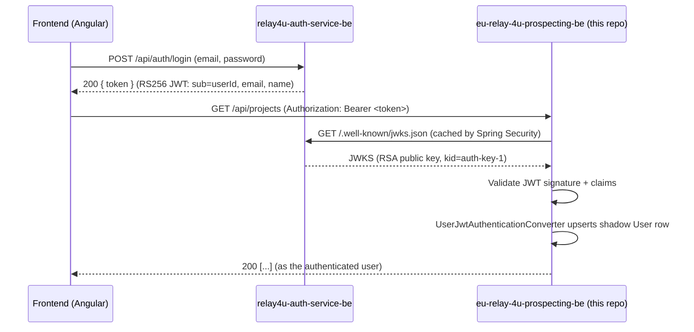

# Architecture

How this service fits into the wider system, and how it authenticates requests without owning any auth logic itself.

## Service split

The application used to be a single monolith that also handled registration/login/JWT issuing. That logic has been extracted into a standalone service, `relay4u-auth-service-be`. This repo is now a pure **OAuth2 Resource Server**: it trusts JWTs signed by the auth service and never sees a password.

## Security configuration

`SecurityConfig` builds a stateless `SecurityFilterChain`:
- CSRF disabled, CORS enabled (`cors.allowed-origins`, default `http://localhost:4200`).
- `/error`, `/swagger-ui/**`, `/v3/api-docs/**` are `permitAll`.
- Everything else requires a valid JWT (`.oauth2ResourceServer(oauth2 -> oauth2.jwt(...))`), validated against `spring.security.oauth2.resourceserver.jwt.jwk-set-uri` (env `AUTH_SERVICE_JWKS_URI`).

## `UserJwtAuthenticationConverter`

Spring Security's resource-server support validates the JWT signature and expiry automatically, then hands the parsed `Jwt` to this converter (`security/UserJwtAuthenticationConverter.java`), which:

1. Reads claims: `sub` → numeric user id, `email`, `name` (these are the exact claim names produced by `relay4u-auth-service-be`'s `JwtUtil`).
2. Upserts a local shadow `User` row (`id`, `name`, `email`) via `UserRepository` — so the user always exists locally even on their first request after registering, with no separate provisioning step.
3. Returns a `UsernamePasswordAuthenticationToken` whose principal is the `User` entity and whose authorities are **empty** (`List.of()`).

This `User` entity is what controllers receive via `@AuthenticationPrincipal User user`.

## Why zero authorities is fine (for now)

There is no `@PreAuthorize`/`hasRole`/`hasAuthority` anywhere in this codebase — authorization is simply "authenticated or not", scoped further by row-ownership checks in the service layer (e.g. `findOwnedProject` in `ProjectServiceImpl`). If role-based authorization is ever introduced, it will need to be added both here (reading a `roles`/`authorities` claim) and in `relay4u-auth-service-be` (issuing it).

## Data ownership

Every `Project`/`ProspectRecord` operation is scoped to the authenticated user — services look up records via `findByIdAndOwner`-style queries and throw `ProjectNotFoundException` (mapped to 404, not 403) if the resource exists but belongs to someone else. This deliberately avoids leaking existence of other users' data.
