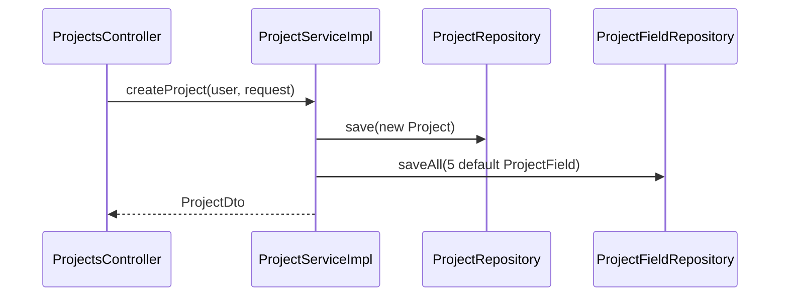
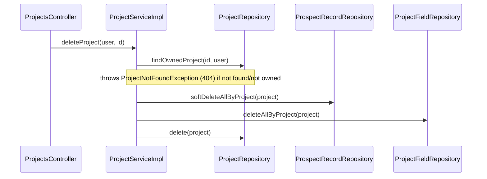
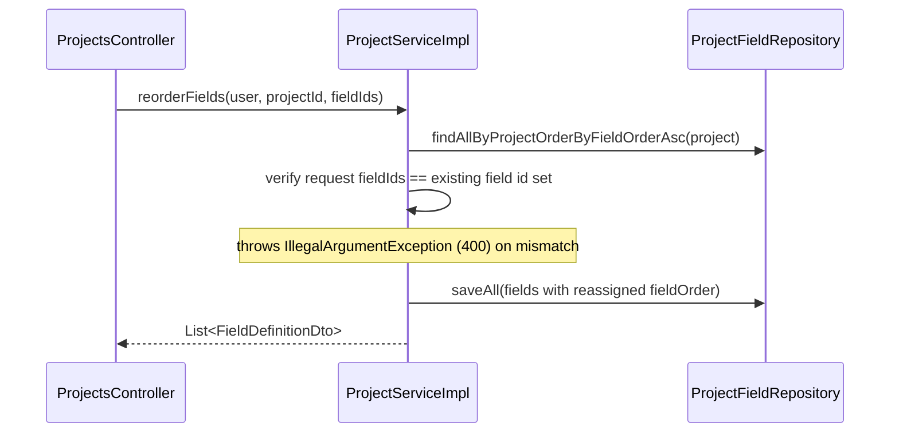
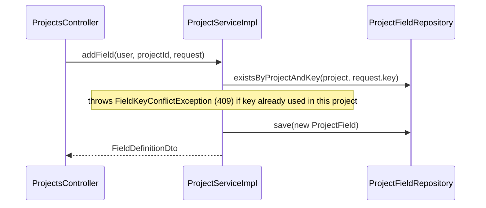

# `ProjectsController` — `/api/projects`

All endpoints require a valid JWT (see [architecture.md](../architecture.md)) and are scoped to the authenticated user via `@AuthenticationPrincipal User user`. Controller methods are thin — they delegate immediately to `ProjectServiceImpl` (or `RecordServiceImpl` for the nested `records` endpoints) with no business logic of their own.

## Endpoints

| Method | Path | Request | Response | Description |
|---|---|---|---|---|
| GET | `/` | – | `List<ProjectSummaryDto>` | List the current user's projects, each with field/record counts |
| POST | `/` | `CreateProjectRequest{name*, description}` | 201 `ProjectDto` | Create a project, seeded with 5 default fields |
| GET | `/{id}` | – | `ProjectDto` | Get project detail with fields ordered by `fieldOrder` |
| PUT | `/{id}` | `UpdateProjectRequest{name?, description?}` | `ProjectDto` | Partially update name/description |
| DELETE | `/{id}` | – | 204 | Delete a project (see note on cascade behavior below) |
| POST | `/{id}/fields` | `CreateFieldRequest{key*, label*, type*, required, order}` | 201 `FieldDefinitionDto` | Add a custom field definition |
| DELETE | `/{id}/fields/{fieldId}` | – | 204 | Remove a field definition |
| PUT | `/{id}/fields/order` | `ReorderFieldsRequest{fieldIds: List<UUID>}` | `List<FieldDefinitionDto>` | Reorder all fields in one call |
| GET | `/{id}/records` | – | `List<ProspectRecordDto>` | List records in a project, oldest first |
| POST | `/{id}/records` | – | 201 `ProspectRecordDto` | Create a new empty record |
| DELETE | `/{id}/records` | – | 204 | Soft-delete all records in a project |

`*` = required, Bean-Validation annotated.

## Flow: create a project

Creating a project always seeds 5 default fields (`contact_name`, `company`, `message_sent`, `replied`, `reply_content`) so a new project is immediately usable as a spreadsheet.

## Flow: delete a project

**Note the asymmetric cascade**: records are *soft*-deleted (`isDeleted=true`, kept for audit/recovery), while fields and the project itself are *hard*-deleted. This is intentional current behavior, not a bug — but worth knowing if you're debugging "missing" data or building a restore feature.

## Flow: reorder fields

The request must contain exactly the set of field ids that currently exist on the project — a mismatch (missing id, extra id, or id from another project) is rejected as a client error rather than silently ignored.

## Flow: add a field

## Ownership checks

Every `{id}` endpoint resolves the project via `findOwnedProject(id, user)`, which queries by `(id, owner)` together — a project belonging to another user returns **404**, not 403, to avoid revealing that the id exists at all.
