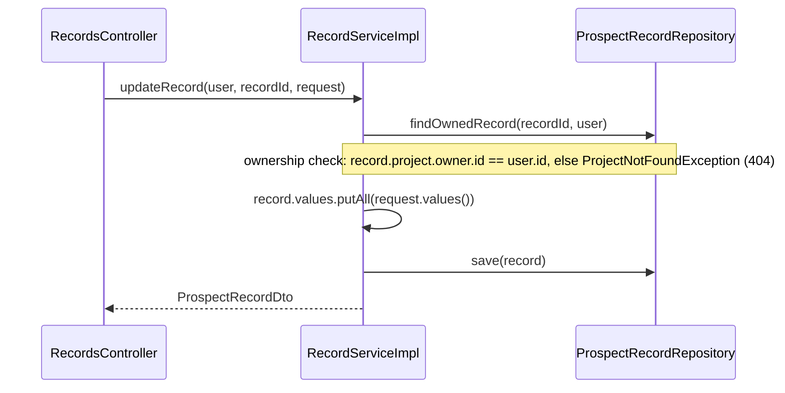

# `RecordsController` — `/api/records`

Endpoints for mutating a single record directly (as opposed to the project-scoped list/create/clear endpoints, which live under `ProjectsController` — see [projects.md](projects.md)).

## Endpoints

| Method | Path | Request | Response | Description |
|---|---|---|---|---|
| PUT | `/{recordId}` | `UpdateRecordRequest{values: Map<String,Object>}` | `ProspectRecordDto` | Merge given key/value pairs into a record's dynamic value map |
| DELETE | `/{recordId}` | – | 204 | Hard-delete a single record |

## Flow: update a record

Record data is a free-form `Map<String, Object>` keyed by `ProjectField.key` (the "spreadsheet cell" model — see the root README's domain model). `updateRecord` does a **merge**, not a replace: only the keys present in the request body are overwritten, everything else on the record is left untouched.

## Ownership checks

Unlike `ProjectsController`, there's no direct `owner` field on `ProspectRecord` — `findOwnedRecord` walks `record.getProject().getOwner().getId()` and compares against the authenticated user, throwing `ProjectNotFoundException` (404) if it doesn't match or the record doesn't exist. This keeps the same "don't reveal existence" behavior as project-level endpoints.

## Delete a record

`deleteRecord` is a straightforward hard delete (no soft-delete) after the same `findOwnedRecord` check — contrast with `DELETE /api/projects/{id}/records` (bulk clear), which soft-deletes instead.
